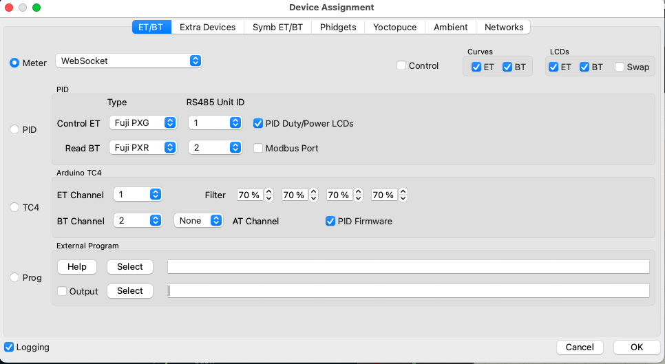
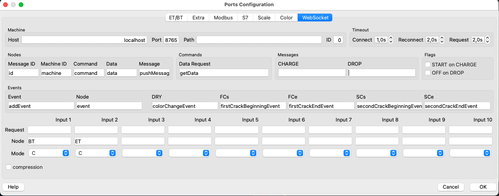
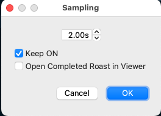
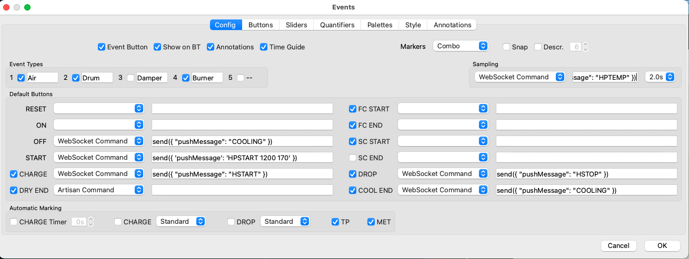
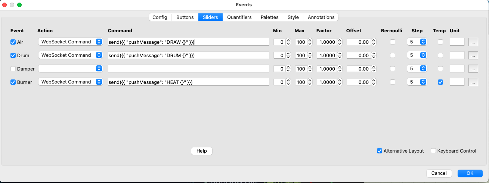

# Sandbox Smart Roaster Controller

⚠️ **WORK IN PROGRESS** ⚠️

A Python-based Bluetooth Low Energy (BLE) controller for managing and monitoring a [Sandbox Smart](https://www.sandboxsmart.com) coffee roaster. This project aims to create a bridge the device and [Artisan Scope](https://artisan-scope.org/), the popular open-source coffee roasting software.

## Project Goal

The main objective of this project is to enable seamless integration between the device and Artisan Scope. While the current implementation provides direct control through a command-line interface, the end goal is to create a compatible driver that will allow Artisan Scope to:

- Monitor roasting temperatures in real-time
- Control roaster parameters directly from the Artisan interface
- Record and reproduce roasting profiles
- Leverage all of Artisan's advanced roasting features

**Current Status**: Manual roasting using Artisan Scope works, profile and status management upcoming.

## Features

- Real-time control of roaster parameters:
  - Heat power adjustment (0-100%)
  - Drum speed control (0-100%)
  - Fan speed control (0-100%)
  - Light control (on/off)
- Temperature monitoring
- Preheating configuration
- Cooling cycle management
- Automated safety shutdown
- Status handling

## Requirements

- Python 3.7+
- `bleak` library for BLE communication
- `websockets` library for managing the communications with Artisan Scope
- Sandbox Smart home coffee roaster (tested with R1 but it should work with R2 as well)

## Installation

1. Clone this repository:
```bash
git clone https://github.com/jzarca01/artisan-sandboxsmart
cd artisan-sandboxsmart
```

2. Install the required dependencies:
```bash
pip install -e ".[dev]"
```

## Usage

### Run the CLI with either the device name or address:

```bash
# Using device name
python3 cli.py --name <device-name>

# Using device address
python3 cli.py --address <device-address>

# For macOS users
python3 cli.py --address <device-address> --macos-use-bdaddr
```

#### Command Line Arguments

- `--name <name>`: Connect to device by name
- `--address <address>`: Connect to device by Bluetooth address
- `--macos-use-bdaddr`: Use Bluetooth address instead of UUID on macOS
- `-d, --debug`: Enable debug logging

#### Available Commands

Once connected, you can use the following commands through the interactive menu:

- `HEAT 0-100` - Set heat power
- `DRUM 0-100` - Set drum speed
- `DRAW 0-100` - Set fan speed
- `LIGHT ON` / `LIGHT OFF` - Control lights
- `HPTEMP` - Get current temperature
- `HSTOP` - Stop the roaster
- `COOLING` - Activate cooling cycle
- `HPSTART 1200 200` - Start preheating (time / temperature)
- `HSTART` - Start roasting
- `EXIT` - Exit the application

### Run the websockets server

```bash
# Device infos are set directly in the main function
python3 server.py
```

### Run the websockets client (optional)

```bash
python3 cli_ws.py --url ws://localhost:8765
```

## Integration with Artisan Scope

### Configuration

- Config > Device



- Config > Port > Websocket



- Config > Sampling



- Config > Events > Config



Here you can change preheating parameters with the following syntax `HPSTART 1200 200` - Start preheating (time (in seconds no need to change)  / temperature) 

- Config > Events > Sliders



⚠️ **Beware of the double brackets** ⚠️

- Make sure Config > Temperature is set to `Celsius Mode`

### Start roasting

- Start the websocket server
- Press the `ON` button in Artisan, Websocket should connected
- Start preheating by pressing the `START` button
- When preheating is finished, start roasting by pressing the `CHARGE` button
- You can set the `Air` (Fan), `Burner` (Heat) and `Drum` settings value directly from the interface
- The `DROP` button stops the roasting
- The `COOL END` button starts the cooling

## Technical Details

The application uses the following BLE characteristics:
- Notification UUID: `0000ffa1-0000-1000-8000-00805f9b34fb`
- Roaster Control UUID: `0000ffa0-0000-1000-8000-00805f9b34fb`

The controller implements an asynchronous architecture using:
- Asyncio for BLE communication
- Threading for user interface
- Queue for command processing

## Roadmap

### Implemented Features
- [x] Basic BLE communication and device discovery
- [x] Command-line interface structure
- [x] Pre-heating
- [x] Start/Stop roasting commands
- [x] Light control
- [x] Cooling cycle command
- [x] Temperature reading
- [x] Manual Heat power control
- [x] Manual Drum speed control
- [x] Manual Fan speed control
- [x] Websockets server management
- [x] Temperature data formatting for Artisan

### Work in Progress

- [ ] Status management
- [ ] Profile management

## Error Handling

The application includes comprehensive error handling for:
- BLE connection issues
- Command processing errors
- Device communication failures

## Contributing

Contributions are welcome! Please feel free to submit a Pull Request.

## License

[Add your license information here]

## Disclaimer

This software is provided as-is. Please ensure you understand the implications of controlling heating equipment remotely before using this controller.